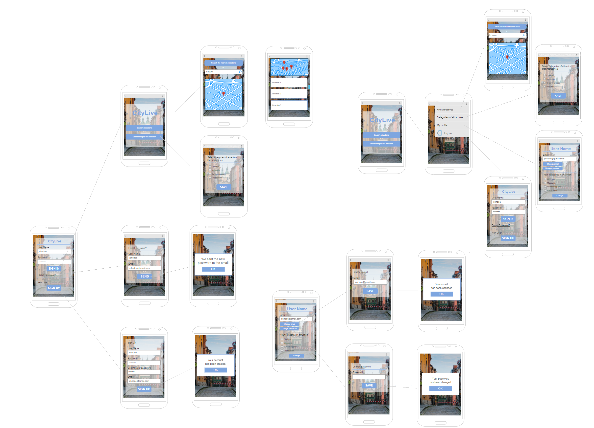

### Opis
Aplikacja CityLive na podstawie lokalizacji gps będzie wyświetlała atrakcje, które znajdują się najbliżej. Użytkownik po zalogowaniu będzie wybierał kategorie atrakcji jakie go interesują (będą one zapamiętywane, tak żeby użytkownik nie musiał ich wybierać za każdym razem - oczywiście będzie istniała możliwość zmiany tych ustawień). Użytkownik będzie mógł dodać atrakcje do ulubionych dzięki czemu jeśli znajdzie się jeszcze raz w okolicy lub mieście aplikacja pokaże jak dalego od użytkownika znajduje się jego ulubiona atrakcja. Na liście atrakcji znajdą się podstawowe informacje tj. nazwa, krótki opis, ocena użytkowników, godziny otwarcia.

### Skład grupy
- Magdalena Dynowska
- Piotr Sławek 
- Sebastian Rogala

### Zarządzanie projektem
https://trello.com/b/dpkB4UmK/aplikacja-citylive

### Raport prac
https://docs.google.com/spreadsheets/d/1YejuTqnoduXrT25HvoLxU2271Rv93-7IMHBrT8m7TX0/edit?usp=sharing

### Prototyp
Większą wersje prototypu można pobrać tutaj: https://www.dropbox.com/s/5cq887iq1tjm43t/CityLive_prototyp.html?dl=0

